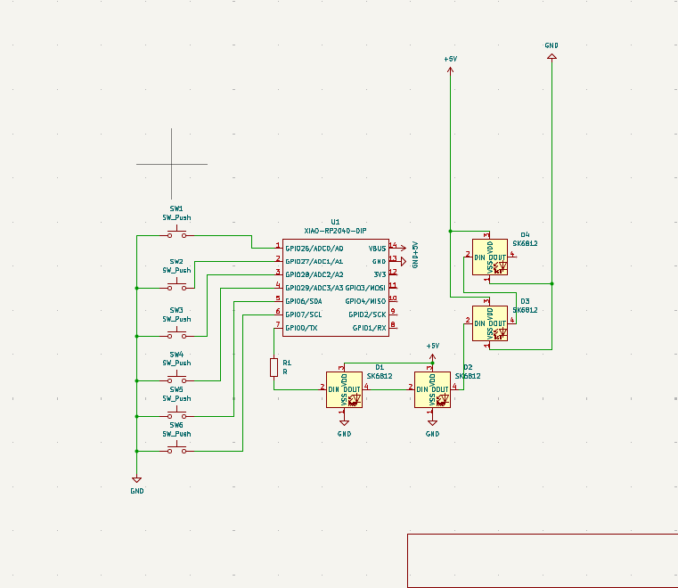

# HackPad
Small keyboard with 6 keys

### Inspiration

I wanted to create a macropad that allowed me to fidget. I created a macropad using 6 switches, 1 rp2040, and 4 leds. 

### Challenges

This is my second time using Fusion 360, and it took a while for me to get the hang of it! I'm still quite proud that it's my first-ever hardware project. 

### Specifications

BOM: 
- 6x Cherry MX Switches
- 4x SK6812 MINI Leds
- 1x XIAO RP2040
- 6x Blank DSA Keycaps
- 330 ohms resistor
- 4x M3x16 Bolt
- 4x M3 Heatset

Others:
- KMK Firmware
- Top Case.stl 
- Bottom Case.stl

Schematic            |  PCB         |   Case
:-------------------------:|:-------------------------:|:-------------------------:|
   |    | 

